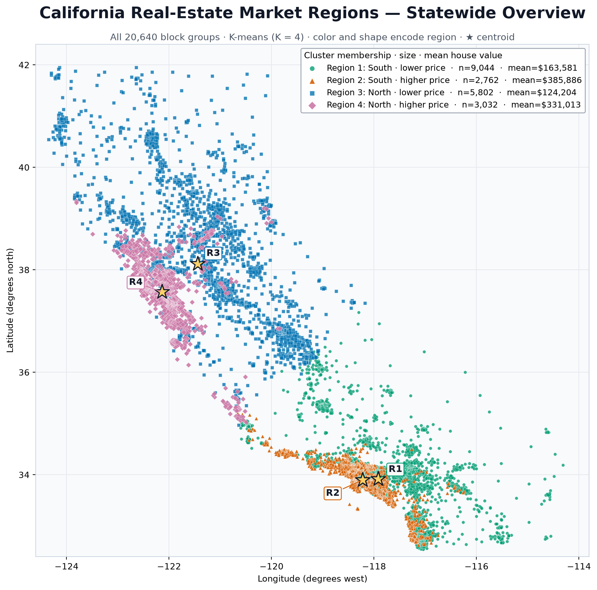
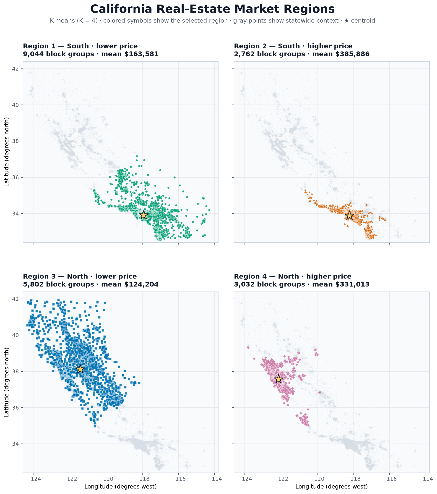

*California housing market regions using K-means clustering*

## Abstract

This project uses K-means clustering to group California housing data into four market regions. The analysis includes 20,640 census block groups and uses longitude, latitude, and median house value. The results show a clear north-south split, along with lower- and higher-price groups in each part of the state. Average house values range from about $124,204 to $385,886. These clusters are useful for exploring broad housing patterns, but they should not be treated as official market boundaries.

## 1. Introduction

Housing prices often depend on location. Nearby communities may have similar access to jobs, transportation, and services, but prices can still vary within the same area. Because of this, it is useful to consider both location and price when grouping housing markets.

The goal of this project is to divide the California Housing data into a small number of regions with similar locations and median house values. We use K-means clustering with longitude, latitude, and median house value. Since the data does not include region labels, clustering allows us to find the groups directly from the data.

## 2. Data

We use the California Housing dataset from scikit-learn. It contains 20,640 observations, with each observation representing a census block group rather than one house. We use three variables:

- `Longitude`: geographic longitude of the block group;
- `Latitude`: geographic latitude of the block group; and
- `MedHouseVal`: median house value, expressed in units of $100,000.

The input is an $n \times 3$ matrix, where $n=20{,}640$. For observation $i$, the feature vector is

$$
x_i=(\text{longitude}_i,\text{latitude}_i,\text{median house value}_i).
$$

This is an unsupervised analysis, so there is no response variable to predict. All three variables are used to decide which observations are similar.

## 3. Methodology

### 3.1 Why K-means is used

K-means divides observations into a chosen number of groups. It works well for this project because each block group can be described by two location variables and one price variable. Observations with similar standardized values are placed in the same cluster. Each cluster has a centroid that represents its average location and house value.

Longitude and latitude help place nearby observations together, while median house value helps separate lower- and higher-price areas. The final clusters therefore reflect both geography and price.

K-means does not require every cluster to form one connected area on a map. For that reason, the clusters are treated as broad market groups rather than official geographic boundaries.

### 3.2 Standardization

K-means uses Euclidean distance, so variables with larger scales can have too much influence. Longitude and latitude are measured in degrees, while median house value is measured in units of $100,000. We standardize the variables so that they are on comparable scales.

We standardize every feature before fitting the model:

$$
z_{ij}=\frac{x_{ij}-\bar{x}_j}{s_j},
$$

where $\bar{x}_j$ is the mean and $s_j$ is the standard deviation of feature $j$. After standardization, each variable has a mean of zero and a standard deviation of one.

### 3.3 Optimization problem

For a selected number of clusters $K$, K-means places the standardized observations into groups $C_1,\ldots,C_K$. Each group has a centroid $\mu_k$. The method minimizes the sum of squared distances between observations and their cluster centroid:

$$
\min_{C_1,\ldots,C_K,\,\mu_1,\ldots,\mu_K}
\sum_{k=1}^{K}\sum_{i\in C_k}\lVert z_i-\mu_k\rVert_2^2.
$$

This value is called inertia. Lower inertia means observations are closer to their assigned centroids.

### 3.4 Estimation algorithm

We use Lloyd's algorithm with k-means++ initialization:

1. Select $K$ starting centroids using k-means++.
2. Assign each observation to its nearest centroid.
3. Update each centroid using the mean of the observations in that cluster.
4. Repeat the assignment and update steps until the clusters stop changing.

The result can depend on the starting centroids. To reduce this issue, we run the model with 20 different initializations and keep the solution with the lowest inertia. We use `random_state=42` so the results can be reproduced.

### 3.5 Hyperparameter selection

The main choice is the number of clusters, $K$. We compare values from 2 to 8 using inertia and the silhouette coefficient. A higher silhouette score means the clusters are more clearly separated.

| $K$ | Inertia | Silhouette coefficient |
|---:|---:|---:|
| 2 | 26,768.4 | 0.545 |
| 3 | 18,289.0 | 0.529 |
| 4 | 12,109.4 | 0.490 |
| 5 | 9,863.6 | 0.472 |
| 6 | 8,113.9 | 0.415 |
| 7 | 6,563.2 | 0.410 |
| 8 | 5,796.4 | 0.395 |

Inertia always decreases when more clusters are added, so the smallest value does not automatically give the best model. The silhouette score is highest for two clusters, but that solution mainly gives a broad geographic split. We select $K=4$ because it lowers inertia and gives a more useful separation by both location and price while remaining easy to interpret.

## 4. Results

### 4.1 Statewide cluster structure

Figure 1 shows all 20,640 observations. Colors and marker shapes identify the clusters, and stars show the cluster centroids. The cluster labels are ordered as southern regions first and northern regions second, with the lower-price group listed before the higher-price group.



The map shows a clear north-south split and a price split within each area. Higher-price clusters are more common near the coast, while lower-price clusters extend farther inland.

### 4.2 Region-specific maps

Figure 2 shows each cluster in a separate panel. The selected region is highlighted, and the rest of the state remains visible in the background. This makes overlapping areas easier to see.



### 4.3 Regional summary

| Region | Interpretation | Block groups | Mean `MedHouseVal` | Approximate mean price |
|---:|---|---:|---:|---:|
| 1 | Southern, lower-price | 9,044 | 1.636 | $163,581 |
| 2 | Southern, higher-price | 2,762 | 3.859 | $385,886 |
| 3 | Northern, lower-price | 5,802 | 1.242 | $124,204 |
| 4 | Northern, higher-price | 3,032 | 3.310 | $331,013 |

Regions 1 and 2 are both in Southern California, but their average house values are very different. Region 2 contains more high-price coastal areas, while Region 1 covers a broader lower-price market. The north has a similar pattern. Region 4 includes higher-price coastal and Bay Area locations, while Region 3 covers more inland and northern areas.

Region 3 has the lowest average value at about $124,204. Region 2 has the highest at about $385,886. Overall, the clusters reflect both the north-south difference and the coastal-inland price difference.

## 5. Discussion and limitations

The four-cluster model gives a simple summary of the dataset using only three variables. Standardization gives each variable a similar role in the distance calculation, and repeated initialization makes the result more stable.

The model also has limitations. K-means does not require clusters to be geographically connected, and it works best with compact groups even though California has an irregular shape. The house value variable is capped at the high end, so differences among the most expensive areas are reduced. The model also leaves out factors such as income, housing density, job access, and local amenities. As a result, the clusters describe patterns in the data but do not explain what causes housing prices.

Future work could use a spatial clustering method that requires connected regions or include more housing-related variables.

## 6. Conclusion

We used longitude, latitude, and median house value to group 20,640 California census block groups into four market regions. The results identify lower- and higher-price groups in both Southern and Northern California. Average house values range from about $124,204 to $385,886.

K-means provides a clear and reproducible way to summarize these patterns. However, the regions are based only on similarity in the selected variables and are not official geographic boundaries.

## Appendix A. Full reproducible code

```python
import pandas as pd
import matplotlib.pyplot as plt
from pathlib import Path
from sklearn.cluster import KMeans
from sklearn.datasets import fetch_california_housing
from sklearn.metrics import silhouette_score
from sklearn.preprocessing import StandardScaler

# Load the dataset and retain the three required variables.
data = fetch_california_housing(as_frame=True)
df = data.frame.copy()
feature_names = ["Longitude", "Latitude", "MedHouseVal"]
X = df[feature_names].dropna().copy()

# Standardize the features used in Euclidean distance calculations.
scaler = StandardScaler()
X_scaled = scaler.fit_transform(X)

# Compare candidate values of K.
diagnostics = []
for k in range(2, 9):
    candidate = KMeans(
        n_clusters=k,
        init="k-means++",
        n_init=20,
        random_state=42,
    )
    candidate_labels = candidate.fit_predict(X_scaled)
    diagnostics.append(
        {
            "K": k,
            "Inertia": candidate.inertia_,
            "Silhouette": silhouette_score(
                X_scaled,
                candidate_labels,
                sample_size=5000,
                random_state=42,
            ),
        }
    )

diagnostics = pd.DataFrame(diagnostics)
print(diagnostics.round({"Inertia": 1, "Silhouette": 3}))

# Fit the selected model.
model = KMeans(
    n_clusters=4,
    init="k-means++",
    n_init=20,
    random_state=42,
)
raw_labels = model.fit_predict(X_scaled)

# Relabel the clusters for stable reporting.
centers_original = pd.DataFrame(
    scaler.inverse_transform(model.cluster_centers_),
    columns=feature_names,
)
south = centers_original.nsmallest(2, "Latitude").sort_values("MedHouseVal")
north = centers_original.nlargest(2, "Latitude").sort_values("MedHouseVal")
ordered_raw_labels = list(south.index) + list(north.index)
label_map = {
    raw_label: region
    for region, raw_label in enumerate(ordered_raw_labels, start=1)
}
X["Region"] = pd.Series(raw_labels, index=X.index).map(label_map)

# Calculate regional summary statistics.
region_summary = X.groupby("Region").agg(
    Block_groups=("MedHouseVal", "size"),
    Mean_longitude=("Longitude", "mean"),
    Mean_latitude=("Latitude", "mean"),
    Mean_MedHouseVal=("MedHouseVal", "mean"),
)
region_summary["Approx_mean_price_USD"] = (
    region_summary["Mean_MedHouseVal"] * 100_000
).round().astype(int)
print(region_summary.round(3))

# Define consistent region colors and marker shapes.
styles = {
    1: {"name": "South · lower price", "color": "#009E73", "marker": "o"},
    2: {"name": "South · higher price", "color": "#D55E00", "marker": "^"},
    3: {"name": "North · lower price", "color": "#0072B2", "marker": "s"},
    4: {"name": "North · higher price", "color": "#CC79A7", "marker": "D"},
}

figure_dir = Path("figures")
figure_dir.mkdir(exist_ok=True)

# Create the combined statewide map.
fig, ax = plt.subplots(figsize=(11.5, 9.5))
ax.set_facecolor("#F8FAFC")
for region in [3, 1, 4, 2]:
    style = styles[region]
    subset = X[X["Region"] == region]
    summary = region_summary.loc[region]
    ax.scatter(
        subset["Longitude"],
        subset["Latitude"],
        s=13 if region in (1, 3) else 17,
        color=style["color"],
        marker=style["marker"],
        alpha=0.78 if region in (1, 3) else 0.90,
        edgecolors="white",
        linewidths=0.2,
        label=(
            f"Region {region}: {style['name']} · "
            f"n={int(summary['Block_groups']):,} · "
            f"mean=${summary['Approx_mean_price_USD']:,.0f}"
        ),
    )

for region in range(1, 5):
    center = region_summary.loc[region]
    ax.scatter(
        center["Mean_longitude"],
        center["Mean_latitude"],
        marker="*",
        s=300,
        color="#FFD166",
        edgecolors="#111827",
        linewidths=1.25,
        zorder=10,
    )

ax.set(
    xlim=(-124.6, -113.8),
    ylim=(32.4, 42.4),
    xlabel="Longitude (degrees west)",
    ylabel="Latitude (degrees north)",
    title="California Real-Estate Market Regions — Statewide Overview",
)
ax.set_aspect("equal", adjustable="box")
ax.grid(alpha=0.2)
ax.legend(title="Cluster membership · size · mean house value")
fig.tight_layout()
fig.savefig(
    figure_dir / "california_kmeans_combined.png",
    dpi=190,
    bbox_inches="tight",
)
plt.show()

# Create four region-specific panels.
fig, axes = plt.subplots(
    2,
    2,
    figsize=(11, 12.5),
    sharex=True,
    sharey=True,
)
for ax, (region, style) in zip(axes.flat, styles.items()):
    subset = X[X["Region"] == region]
    center = region_summary.loc[region]
    ax.scatter(
        X["Longitude"],
        X["Latitude"],
        s=4,
        color="#D8DEE6",
        alpha=0.24,
        linewidths=0,
    )
    ax.scatter(
        subset["Longitude"],
        subset["Latitude"],
        s=13,
        color=style["color"],
        marker=style["marker"],
        alpha=0.88,
        edgecolors="white",
        linewidths=0.22,
    )
    ax.scatter(
        center["Mean_longitude"],
        center["Mean_latitude"],
        marker="*",
        s=270,
        color="#FFD166",
        edgecolors="#111827",
        linewidths=1.15,
    )
    ax.set_title(
        f"Region {region} — {style['name']}\n"
        f"{int(center['Block_groups']):,} block groups · "
        f"mean ${center['Approx_mean_price_USD']:,.0f}",
        loc="left",
    )
    ax.set_xlim(-124.6, -113.8)
    ax.set_ylim(32.4, 42.4)
    ax.set_aspect("equal", adjustable="box")
    ax.grid(alpha=0.2)

for ax in axes[:, 0]:
    ax.set_ylabel("Latitude (degrees north)")
for ax in axes[-1, :]:
    ax.set_xlabel("Longitude (degrees west)")

fig.suptitle("California Real-Estate Market Regions", fontsize=20)
fig.subplots_adjust(
    top=0.875,
    bottom=0.065,
    left=0.08,
    right=0.98,
    hspace=0.24,
    wspace=0.08,
)
fig.savefig(
    figure_dir / "california_kmeans_regions.png",
    dpi=180,
    bbox_inches="tight",
)
plt.show()
```
